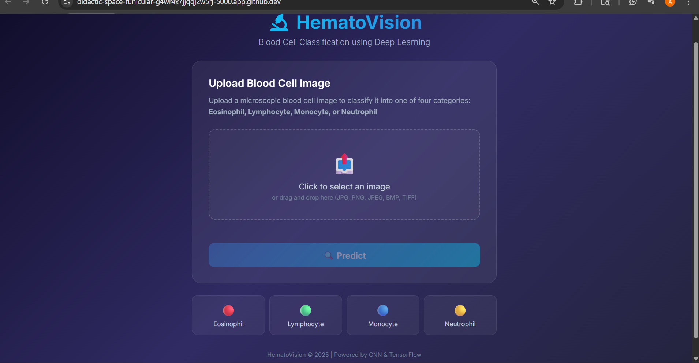
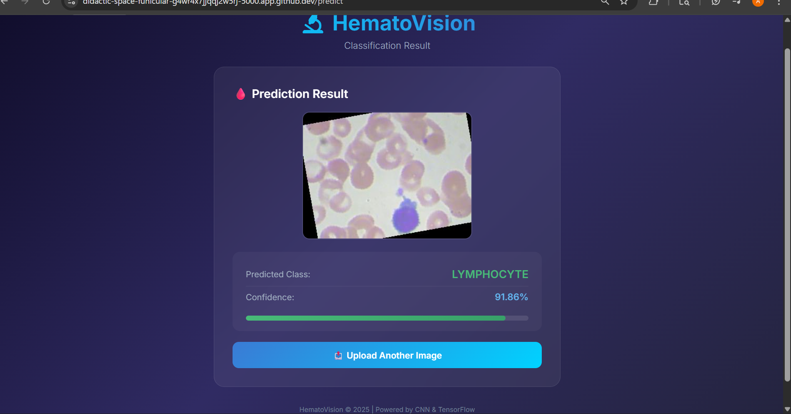

# 1. Project Title
HematoVision - Blood Cell Classification using Deep Learning and Flask

## 2. Objective
HematoVision is a Flask web application that classifies blood cell microscope images into four classes.
It uses a trained CNN model for fast inference from uploaded images.
The project is kept clean, lightweight, and submission-ready.

## 3. Dataset
- Source: Kaggle Blood Cell Dataset
- Classes: Eosinophil, Lymphocyte, Monocyte, Neutrophil
- Dataset files are not included in this repository.

## 4. Model
A custom CNN is used for 4-class classification.
Input images are resized to 224x224.
Pixel values are normalized using rescale = 1./255 before prediction.
The trained model file Blood_Cell.h5 is loaded in the Flask app for inference.

## 5. Accuracy
- Test accuracy: ~80%

## 6. How to Run
1. Clone the repository and enter the HematoVision folder.
2. Create and activate a virtual environment.
3. Install dependencies:
```bash
pip install -r requirements.txt
```
4. Start the app:
```bash
python app.py
```
5. Open http://127.0.0.1:5000 and upload an image.

## 7. Demo
- Home Page screenshot:

- Prediction Result screenshot:

- Demo video : https://drive.google.com/file/d/1x5eGXu-fmqSz3QWw7-OVuILhRIJRnI-M/view?usp=sharing
